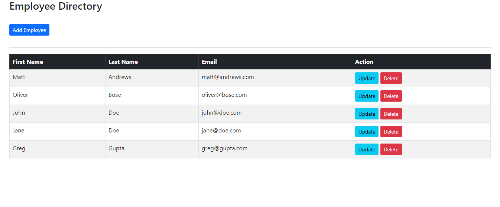
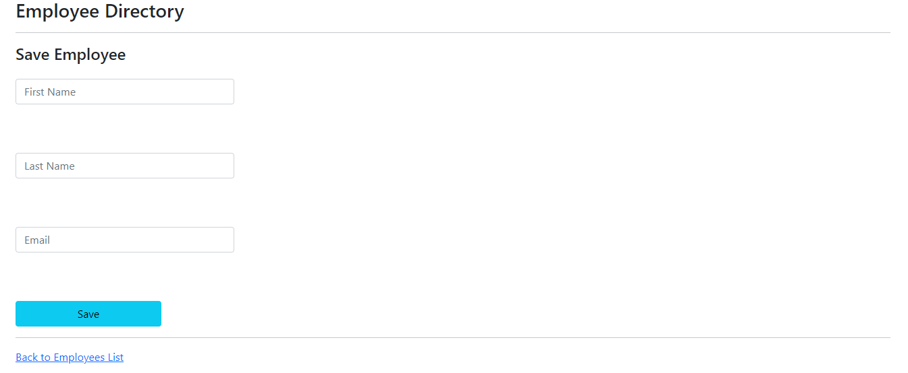

## Spring Boot-Thymeleaf app

A simple CRUD application built using Thymeleaf and Spring Boot based on MVC architecture

### Technologies
* [Spring Boot](https://spring.io/)
* [Thymeleaf](https://www.thymeleaf.org/)
* [Bootstrap](https://getbootstrap.com/)
* [MySQL](https://www.mysql.com/)

### Usage
To run the application on your own computer, first fill in the necessary fields in the applicaton.properties file.

```
spring.datasource.url=jdbc:mysql://localhost:3306/YOUR_MYSQL_DB_NAME
spring.datasource.username=YOUR_MYSQL_USERNAME
spring.datasource.password=YOUR_MYSQL_PASSWORD
```

Then, copy and paste the employee-directory.sql file in the sql-scripts folder, which is located among the other application folders, into the MySQL application and run it.
Finally, when you run the application, visit localhost:8080.


### Screenshots


